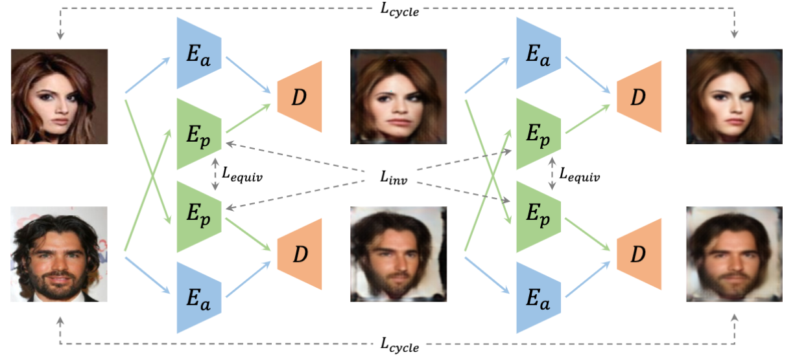

# Unsupervised Landmark Learning from Unpaired Data

[[Paper](https://arxiv.org/pdf/2007.01053.pdf)]
[Project Page]

## News
- Full codebae is coming soon


## Bibtex
```
@inproceedings{xu2020ultra,
  title={Unsupervised Landmark Learning from Unpaired Data},
  author={Xu, Yinghao and Yang, Ceyuan, and Liu, Ziwei and Dai, Bo and Zhou, Bolei},
  booktitle={arXiv preprint arXiv:2007.01053},
  year={2020},
}
```
